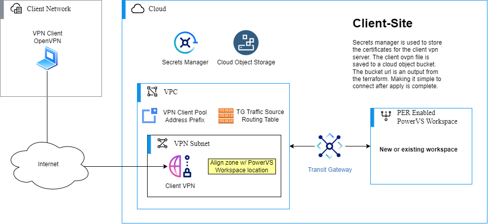
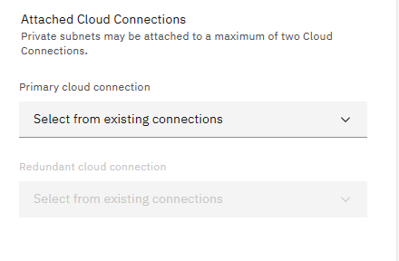
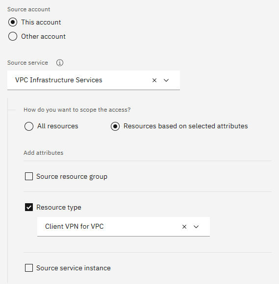
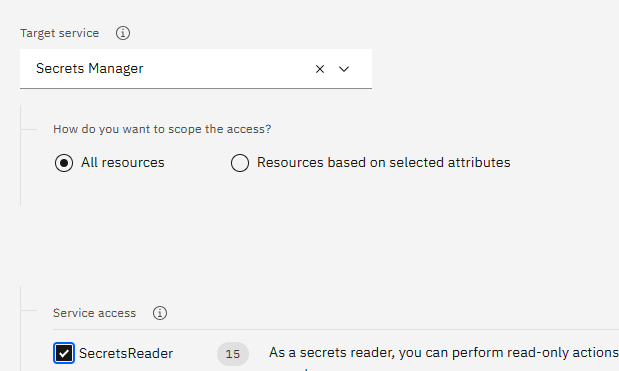

# PowerVPN Client to Site Server

## Overview

Customized by Faad Ghoraishi using BOB - 9/6/2026

This Terraform module will create a VPC Client-based VPN Server and attach it to a new or existing PowerVS
Workspace. Providing secure access to IBM Cloud Power infrastructure.
Additionally, it will create an IBMi server in the PowerVS workspace and attaches a customizable data disk to the IBMi.
IBMi resources such as core and RAM are also customizable.

This Terraform module deploys the following infrastructure:

- VPC
- VPC Subnet
- VPC Security Groups
- VPC VPN Server
- COS Bucket with OVPN file
- Secrets Manager Certificate
- IBMi paramters
- PowerVS Workspace (Optional)
- Transit Gateway (Optional)
- Cloud Connection w/DirectLink* (Optional)

\* Only in locations without
[Power Edge Routers](https://cloud.ibm.com/docs/power-iaas?topic=power-iaas-per)

### Deployment Model

### Power Edge Router vs Cloud Connection

This automation includes a [data file](./data/locations.yaml) to determine if a PowerVS location has
a Power Edge Router. If the location does not have a Power Edge Router, the automation will create a
Cloud Connection and connect it's Direct Link connection to the Transit Gateway to route traffic to
the VPC.

When using a PowerVS location where a Cloud Connection is needed, Subnets created in the PowerVS
Workspace will need to be connected with the Cloud Connection before traffic will be routed to the
Transit Gateway. This can be done during the Subnet creation.

## Setup Requirements

### Prerequisites

#### Upgrading your IBM Cloud Account

To order and use IBM Cloud services, billing information is required for your account. See
[Upgrading Your Account](https://cloud.ibm.com/docs/account?topic=account-upgrading-account).

#### IAM Access

You will need the following IAM access, or higher, to deploy this VPN

|Service Name (Resource Type)|Service Access|Platform Access|
|---|---|---|
|VPC Infrastructure Services   - Virtual Private Cloud   - Subnet   - Security Group for VPC   - Client VPN for VPC ||Editor|
|Cloud Object Storage|Writer||
|Secrets Manager|Writer||
|Transit Gateway   - Transit Gateway|Manager|Editor|
|Workspace for Power Systems Virtual Server|Manager|Editor|

#### Install Terraform

If you wish to run Terraform locally, see
[Install Terraform](https://learn.hashicorp.com/tutorials/terraform/install-cli#install-terraform).

#### IBM Cloud API Key

You must supply an IBM Cloud API key so that Terraform can connect to the IBM Cloud Terraform
provider. See
[Create API Key](https://cloud.ibm.com/docs/account?topic=account-userapikey&interface=ui#create_user_key).

#### Secrets Manager

An [IBM Secrets Manager](https://www.ibm.com/cloud/secrets-manager) instance is used to store the certificate created by this module for use with the VPN Server. If an existing Secrets Manager name is provided in `secret_manager_name`, it will be looked up and used. If `secret_manager_name` is omitted or empty, this module will automatically provision a new Secrets Manager instance (Standard plan). The Secrets Manager may be located in any region or Resource Group. To specify a different Resource Group, set the optional variable `secret_manager_resource_group_name`.

#### Authorization Policy

This Terraform automation automatically manages the IAM service-to-service authorization policy (`ibm_iam_authorization_policy.vpn_secrets_manager`), which authorizes VPC Infrastructure Services (`is`) with resource type `vpn-server` (`Client VPN for VPC`) to access Secrets Manager (`secrets-manager`) with the `SecretsReader` role.

| Source Service | Target Service |
:---:|:---:
|  |  |

#### Object Storage

An [IBM Cloud Object Storage](https://www.ibm.com/cloud/object-storage) instance and Smart Tier regional bucket are used to store the OpenVPN configuration file created by this module. If an existing COS instance name is provided in `cos_instance_name`, it will be looked up and used. If `cos_instance_name` is omitted or empty, this module will automatically provision a new Cloud Object Storage instance (Standard plan) and create a Smart Tier regional bucket. To specify a different Resource Group for COS, set the optional variable `cos_instance_resource_group_name`.

## Variable Behavior

There are a number of variables defined in variables.tf used by this Terraform module to deploy and
configure your infrastructure. This section will describe variable behavior. See
[variables.tf](./variables.tf) for full list of variables with their descriptions, defaults, and
conditions.

## Support

If you have problems or questions when using the underlying IBM Cloud infrastructure, you can get
help by searching for information or by asking questions through one of the forums. You can also
create a case in the
[IBM Cloud console](https://cloud.ibm.com/unifiedsupport/supportcenter).

For information about opening an IBM support ticket, see
[Contacting support](https://cloud.ibm.com/docs/get-support?topic=get-support-using-avatar).

To report bugs or make feature requests regarding this Terraform module, please create an issue in
this repository.

## References

- [What is Terraform](https://www.terraform.io/intro)
- [IBM Cloud provider Terraform getting started](https://cloud.ibm.com/docs/ibm-cloud-provider-for-terraform?topic=ibm-cloud-provider-for-terraform-getting-started)
- [IBM Cloud VPC VPN Server](https://cloud.ibm.com/docs/vpc?topic=vpc-vpn-client-to-site-overview)
- [IBM Cloud PowerVS](https://www.ibm.com/products/power-virtual-server)
- [IBM Power Edge Router](https://cloud.ibm.com/docs/power-iaas?topic=power-iaas-per)
- [IBM Cloud Connection](https://cloud.ibm.com/docs/power-iaas?topic=power-iaas-cloud-connections)

<!-- BEGINNING OF PRE-COMMIT-TERRAFORM DOCS HOOK -->
## Requirements

| Name | Version |
|------|---------|
|  [terraform](#requirement\_terraform) | >= 1.0.0 |
|  [ibm](#requirement\_ibm) | 1.62.0 |
|  [random](#requirement\_random) | 3.5.1 |

## Providers

| Name | Version |
|------|---------|
|  [ibm](#provider\_ibm) | 1.62.0 |
|  [random](#provider\_random) | 3.5.1 |

## Modules

| Name | Source | Version |
|------|--------|---------|
|  [certificate](#module\_certificate) | ./modules/certificate | n/a |
|  [cloud\_connection](#module\_cloud\_connection) | ./modules/cloud-connection | n/a |
|  [cos\_upload](#module\_cos\_upload) | ./modules/cos-upload | n/a |
|  [ibmi](#module\_ibmi) | ./modules/ibmi | n/a |
|  [ovpn](#module\_ovpn) | ./modules/ovpn | n/a |
|  [power](#module\_power) | ./modules/power | n/a |
|  [powervs\_network](#module\_powervs\_network) | ./modules/powervs-network | n/a |
|  [powervs\_ssh\_key](#module\_powervs\_ssh\_key) | ./modules/powervs-ssh-key | n/a |
|  [transit](#module\_transit) | ./modules/transit | n/a |
|  [vpc](#module\_vpc) | ./modules/vpc | n/a |
|  [vpn](#module\_vpn) | ./modules/vpn | n/a |

## Resources

| Name | Type |
|------|------|
| [ibm_iam_authorization_policy.vpn_secrets_manager](https://registry.terraform.io/providers/IBM-Cloud/ibm/1.62.0/docs/resources/iam_authorization_policy) | resource |
| [random_string.resource_identifier](https://registry.terraform.io/providers/hashicorp/random/3.5.1/docs/resources/string) | resource |
| [ibm_resource_group.cos_instance](https://registry.terraform.io/providers/IBM-Cloud/ibm/1.62.0/docs/data-sources/resource_group) | data source |
| [ibm_resource_group.group](https://registry.terraform.io/providers/IBM-Cloud/ibm/1.62.0/docs/data-sources/resource_group) | data source |
| [ibm_resource_group.secret_manager](https://registry.terraform.io/providers/IBM-Cloud/ibm/1.62.0/docs/data-sources/resource_group) | data source |
| [ibm_resource_instance.power_workspace](https://registry.terraform.io/providers/IBM-Cloud/ibm/1.62.0/docs/data-sources/resource_instance) | data source |

## Inputs

| Name | Description | Type | Default | Required |
|------|-------------|------|---------|:--------:|
|  [cos\_instance\_name](#input\_cos\_instance\_name) | The Cloud Object Storage instance name used to create a bucket with OVPN configuration file in. If left empty or if no existing instance with this name is found, a new COS instance (Standard plan) and a Smart Tier regional bucket will be provisioned.  The COS instance maybe in any Resource Group. By default, the Resource Group specified by the variable `resource_group_name` will be used to locate the COS instance. However, if the COS instance is in another Resource Group use the optional variable `cos_instance_resource_group_name` to specify it. | `string` | `""` | no |
|  [cos\_instance\_resource\_group\_name](#input\_cos\_instance\_resource\_group\_name) | Optional variable to specify the Resource Group the Cloud Object Storage instance is in. If not supplied, the value specified for `resource_group_name` will be used to locate your COS instance. | `string` | `""` | no |
|  [create\_default\_vpc\_address\_prefixes](#input\_create\_default\_vpc\_address\_prefixes) | Optional variable to indicate whether a default address prefix should be created for each zone in this VPC. | `bool` | `false` | no |
|  [data\_location\_file\_path](#input\_data\_location\_file\_path) | Optional variable to specify Where the file with PER location data is stored. This variable is used for testing, and should not normally need to be altered. | `string` | `"./data/locations.yaml"` | no |
|  [ibmcloud\_api\_key](#input\_ibmcloud\_api\_key) | The IBM Cloud platform API key needed to deploy IAM enabled resources. | `string` | n/a | yes |
|  [name](#input\_name) | The name used for the new Power Workspace, Transit Gateway, and VPC. Other resources created will use this for their basename and be suffixed by a random identifier. | `string` | n/a | yes |
|  [power\_cloud\_connection\_speed](#input\_power\_cloud\_connection\_speed) | Optional variable to specify the speed of the cloud connection (speed in megabits per second). This only applies to locations WITHOUT Power Edge Routers.  Supported values are 50, 100, 200, 500, 1000, 2000, 5000, 10000. Default Value is 1000. | `number` | `1000` | no |
|  [power\_workspace\_location](#input\_power\_workspace\_location) | The location used to create the power workspace.  Available locations are: dal10, dal12, us-south, us-east, wdc06, wdc07, sao01, sao04, tor01, mon01, eu-de-1, eu-de-2, lon04, lon06, syd04, syd05, tok04, osa21, mad02, mad04. Please see [PowerVS Locations](https://cloud.ibm.com/docs/power-iaas?topic=power-iaas-creating-power-virtual-server) for a complete list of PowerVS locations. | `string` | n/a | yes |
|  [power\_workspace\_name](#input\_power\_workspace\_name) | Optional variable to specify the name of an existing power workspace. If supplied the workspace will be used to connect the VPN with. | `string` | `""` | no |
|  [powervs\_ssh\_public\_key](#input\_powervs\_ssh\_public\_key) | Public SSH key string to import into the Power Virtual Server workspace. If provided, an SSH key resource will be created in the PowerVS workspace and automatically used for the IBMi instance (unless overridden). | `string` | `""` | no |
|  [powervs\_ssh\_key\_name](#input\_powervs\_ssh\_key\_name) | Name for the PowerVS SSH key created from `powervs_ssh_public_key`. | `string` | `""` | no |
|  [powervs\_subnet\_name](#input\_powervs\_subnet\_name) | Name for the Power Virtual Server subnet network to create. | `string` | `""` | no |
|  [powervs\_subnet\_cidr](#input\_powervs\_subnet\_cidr) | CIDR block for the Power Virtual Server subnet network to create in the PowerVS workspace (e.g. 192.168.100.0/24). When provided, the subnet network will be created and automatically attached to the IBMi instance. | `string` | `""` | no |
|  [powervs\_subnet\_type](#input\_powervs\_subnet\_type) | Type of PowerVS subnet network to create (vlan or pub-vlan). Default is vlan. | `string` | `"vlan"` | no |
|  [powervs\_subnet\_gateway](#input\_powervs\_subnet\_gateway) | Gateway IP address for the PowerVS subnet network. | `string` | `""` | no |
|  [powervs\_subnet\_dns](#input\_powervs\_subnet\_dns) | List of DNS server IP addresses for the PowerVS subnet network. | `list(string)` | `["127.0.0.1"]` | no |
|  [powervs\_subnet\_ipaddress\_range](#input\_powervs\_subnet\_ipaddress\_range) | List of IP address range(s) to allocate within the PowerVS subnet network. | `list(object)` | `[]` | no |
|  [powervs\_subnet\_mtu](#input\_powervs\_subnet\_mtu) | Maximum Transmission Unit (MTU) for the PowerVS subnet network. Default is 1450. | `number` | `1450` | no |
|  [ibmi\_instance\_name](#input\_ibmi\_instance\_name) | Name for the IBMi Power Virtual Server instance. | `string` | `""` | no |
|  [ibmi\_ssh\_key\_name](#input\_ibmi\_ssh\_key\_name) | Name of an existing SSH key in the Power Virtual Server workspace to inject into the IBMi instance. Automatically uses created SSH key if omitted. | `string` | `""` | no |
|  [ibmi\_network\_name](#input\_ibmi\_network\_name) | Name of an existing Power Virtual Server network to attach the IBMi instance to. Automatically uses created subnet network if omitted. | `string` | `""` | no |
|  [resource\_group\_name](#input\_resource\_group\_name) | Resource Group to create new resources in (Resource Group name is case sensitive).  This will also be used to locate your existing Secrets Manager and Cloud Object Storage instance. If the Secrets Manager or Cloud Object Storage instance is in a different resource group, use the optional variables `secret_manager_resource_group_name` and `cos_instance_resource_group_name`, respectively, to specify those. | `string` | n/a | yes |
|  [secret\_manager\_name](#input\_secret\_manager\_name) | The Secrets Manager instance name to create the VPN certificate in. If left empty or if no existing instance with this name is found, a new Secrets Manager instance (Standard plan) will be provisioned.  The Secrets Manager maybe in any Resource Group or Region. By default, the Resource Group specified by the variable `resource_group_name` will be used to locate the Secrets Manager. However, if the Secrets Manager is in another Resource Group use the optional variable `secret_manager_resource_group_name` to specify it. | `string` | `""` | no |
|  [secret\_manager\_resource\_group\_name](#input\_secret\_manager\_resource\_group\_name) | Optional variable to specify the Resource Group the Secret Manager is in. If not supplied, the value specified for `resource_group_name` will be used to locate your Secrets Manager. | `string` | `""` | no |
|  [transit\_gateway\_name](#input\_transit\_gateway\_name) | Optional variable to specify the name of an existing transit gateway, if supplied it will be assumed that you've connected your power workspace to it. A connection to the VPC containing the VPN Server will be added, but not for the Power Workspace. Supplying this variable will also suppress Power Workspace creation. | `string` | `""` | no |
|  [vpn\_client\_cidr](#input\_vpn\_client\_cidr) | Optional variable to specify the CIDR for VPN client IP pool space. This is the IP space that will be used by machines connecting with the VPN. You should only need to change this if you have a conflict with your local network. | `string` | `"192.168.8.0/22"` | no |
|  [vpn\_subnet\_cidr](#input\_vpn\_subnet\_cidr) | Optional variable to specify the CIDR for subnet the VPN will be in. You should only need to change this if you have a conflict with your Power Workstation Subnets or with a VPC connected with this solution. | `string` | `"10.134.0.0/28"` | no |

## Outputs

| Name | Description |
|------|-------------|
|  [bucket\_url](#output\_bucket\_url) | URL to bucket containing the OVPN file |
|  [ibmi\_instance\_id](#output\_ibmi\_instance\_id) | ID of the provisioned IBMi Power Virtual Server instance |
|  [ibmi\_instance\_name](#output\_ibmi\_instance\_name) | Name of the provisioned IBMi Power Virtual Server instance |
|  [ibmi\_network\_interface](#output\_ibmi\_network\_interface) | Network interface details for the IBMi instance |
|  [ibmi\_additional\_volume\_ids](#output\_ibmi\_additional\_volume\_ids) | Map of additional data volume names to volume IDs |
|  [powervs\_ssh\_key\_name](#output\_powervs\_ssh\_key\_name) | Name of the PowerVS SSH key created by this automation |
|  [powervs\_subnet\_network\_name](#output\_powervs\_subnet\_network\_name) | Name of the PowerVS subnet network created by this automation |
|  [powervs\_subnet\_network\_id](#output\_powervs\_subnet\_network\_id) | ID of the PowerVS subnet network created by this automation |
<!-- END OF PRE-COMMIT-TERRAFORM DOCS HOOK -->
